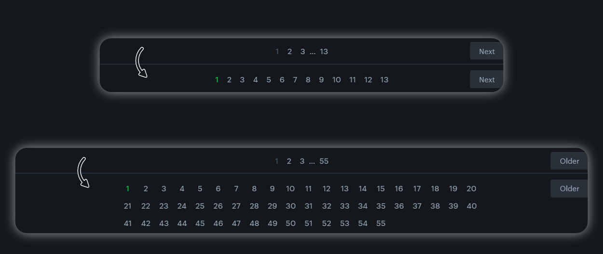

# Letterboxd page numbers userscript

A userscript that adds (all) page numbers to letterboxd. This includes e.g. lists, watched films, etc. (all pages with page numbers).

## Installation
Download a userscript manager addon like [Tampermonkey](https://www.tampermonkey.net/). Click on the script file (.js) above and then on Raw. Then click install.

## Example
